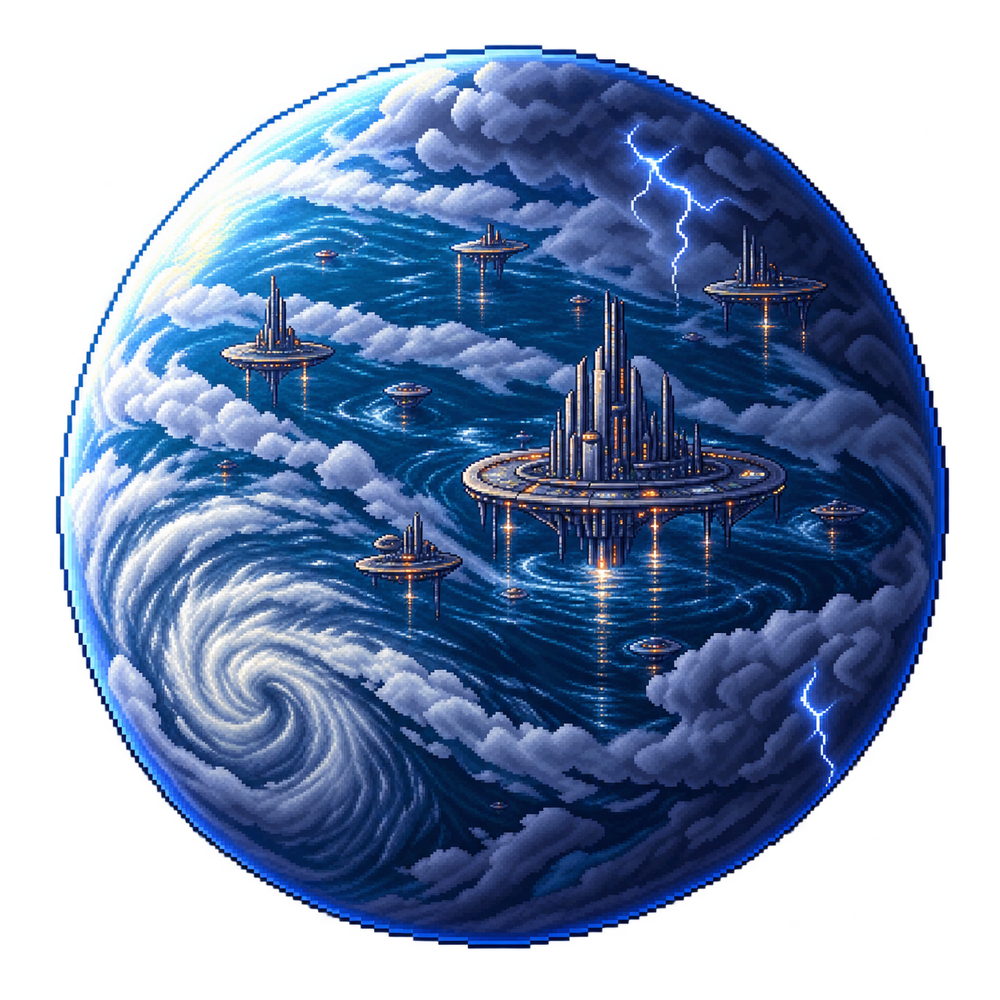
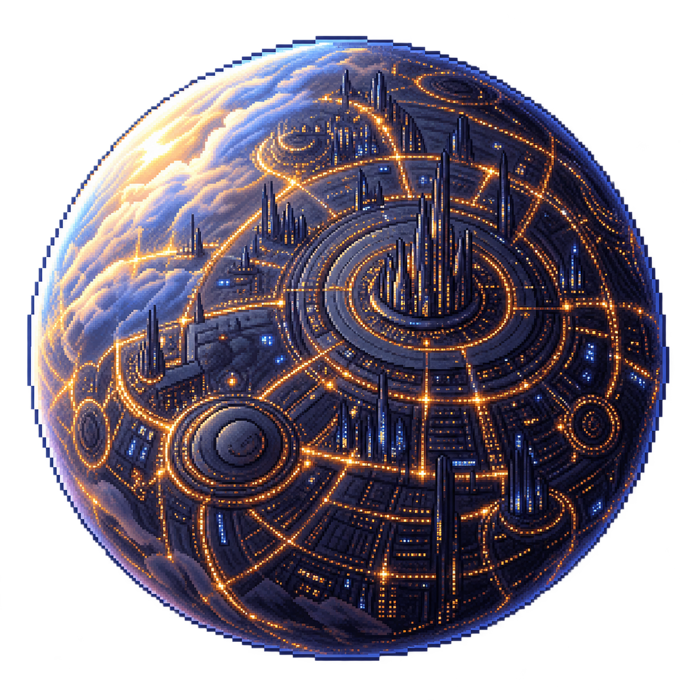
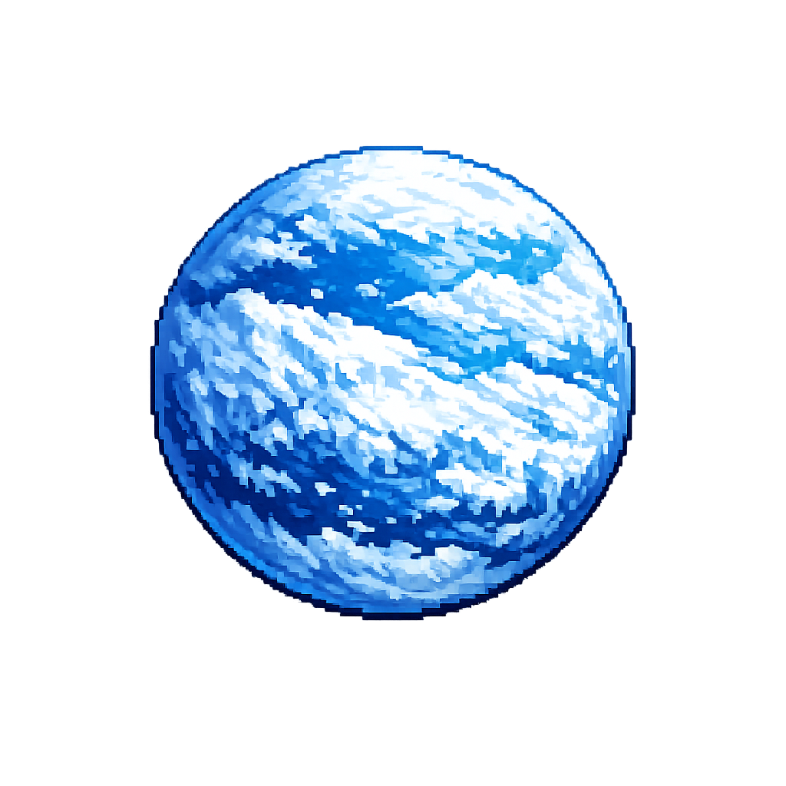
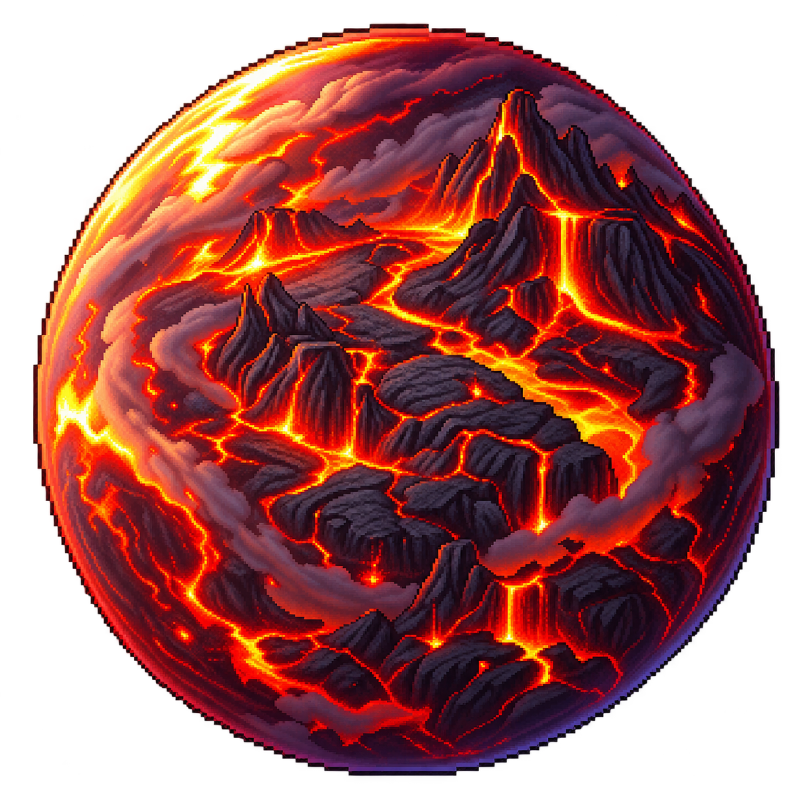
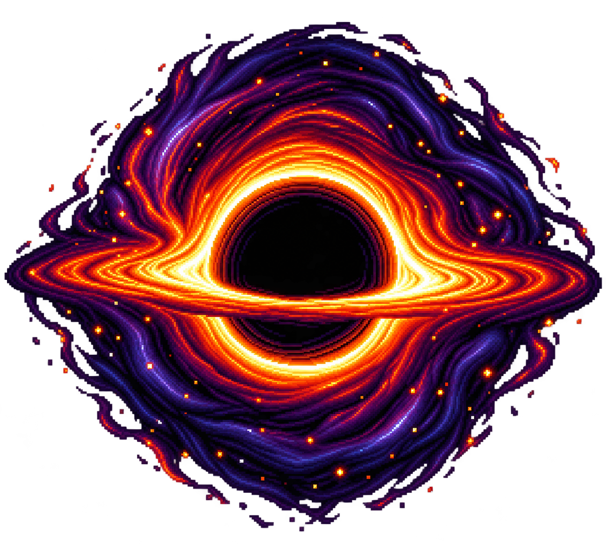
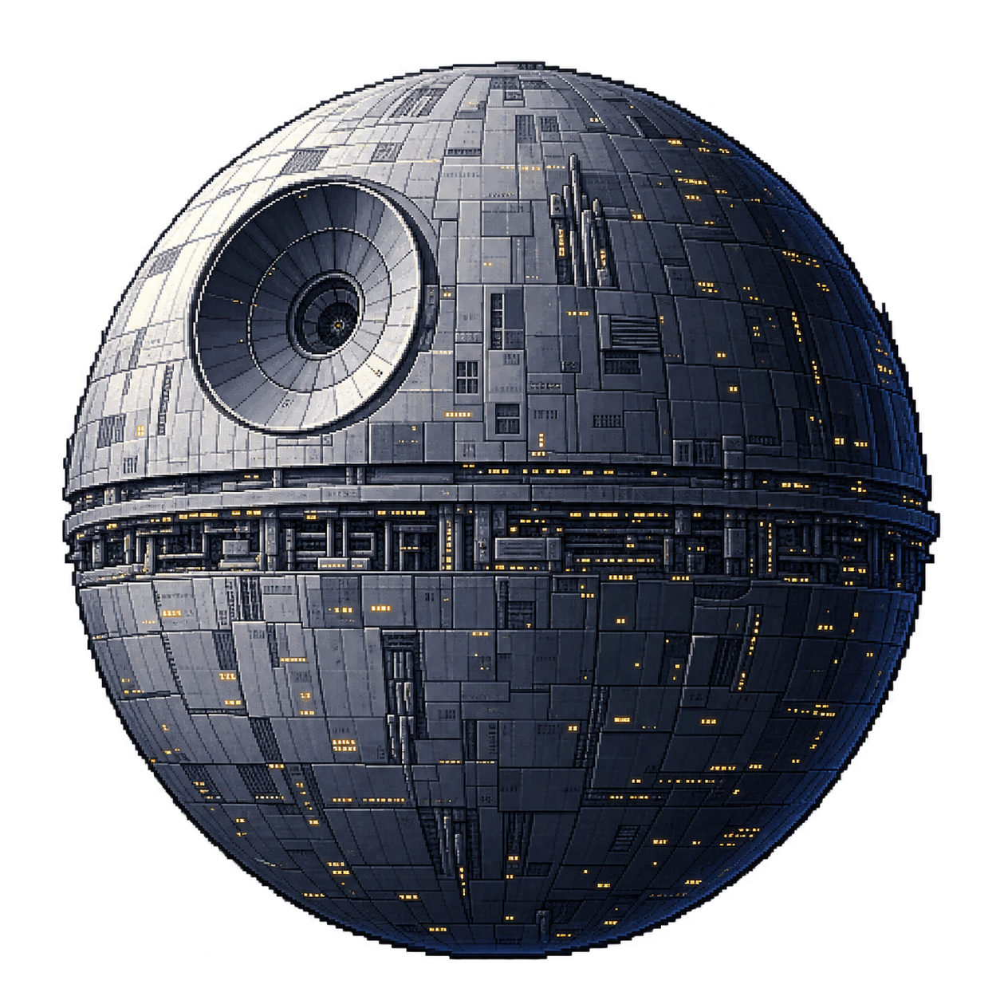
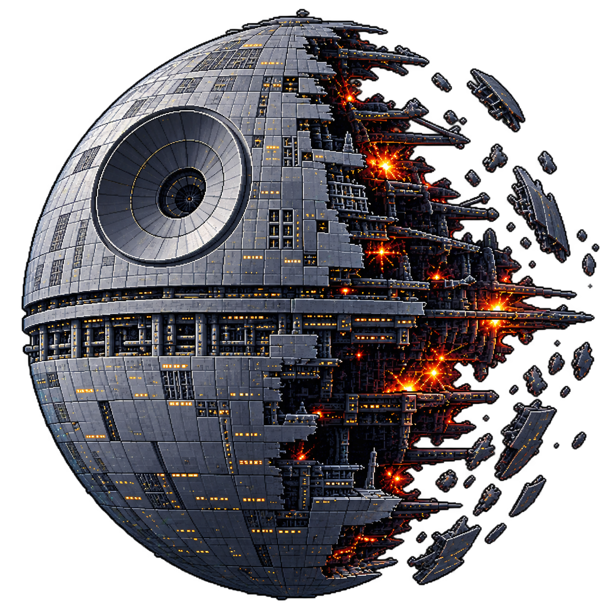
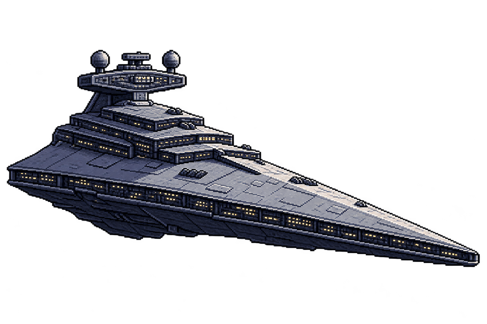

# 🚀 Star Wars: Galactic Assault

Ein actionreiches 2D-Arcade-Weltraumspiel im Stil klassischer Star-Wars-Raumschlachten.

Übernimm die Kontrolle über ikonische Raumschiffe, durchquere gefährliche Asteroidenfelder und stelle dich intelligenten KI-Gegnern. Mit jedem erreichten Sternensystem steigt die Herausforderung, während neue Gegner und Bedrohungen freigeschaltet werden.

---

## 📑 Inhaltsverzeichnis

- [📦 Installation](#-installation)
- [▶ Spiel starten](#-spiel-starten)

- [Features](#-features)
    - [Spielbare Schiffe](#spielbare-schiffe)
    - [Gegner-KI](#gegner-ki)
    - [Gegnerzuordnung](#gegnerzuordnung)
    - [Asteroidensystem](#asteroidensystem)
- [🪐 Planeten & Welten](#-planeten--welten)

- [⚙️ Schwierigkeitssystem](#️-schwierigkeitssystem)
  - [Verfügbare Schwierigkeitsstufen](#verfügbare-schwierigkeitsstufen)
  - [Balancing & Konfiguration](#️-balancing--konfiguration)
  - [Difficulty Presets](#difficulty-presets)
  - [Gegner-Freischaltungen](#gegner-freischaltungen)
  - [Sternensystem-Skalierung](#sternensystem-skalierung)

- [📈 Progression-System](#-progression-system)
- [🌌 Dynamische Sternensysteme](#-dynamische-sternensysteme)

- [🧠 KI-System](#-ki-system)
  - [Komponenten](#komponenten)
  - [Gruppenrollen](#gruppenrollen)
  - [Dodge-System](#dodge-system)
  - [Dynamische Schwierigkeit](#dynamische-schwierigkeit)

- [🎯 Spielziel](#-spielziel)
- [🎮 Steuerung](#-steuerung)
- [📂 Projektstruktur](#-projektstruktur)
- [🛣️ Roadmap](#️-roadmap)
- [🎮 Lokaler PvP-Modus](#-lokaler-pvp-modus)
- [⚠️ Rechtlicher Hinweis](#️-rechtlicher-hinweis)

---

# 📦 Installation

## Voraussetzungen

- Python 3.8 oder neuer
- `pygame` oder `pygame-ce`

### pygame installieren

```bash
pip install pygame
```

### pygame-ce installieren

```bash
pip install pygame-ce
```

---

# ▶ Spiel starten

```bash
pip install -r requirements.txt
python StarWarsGame.py
```

---

# 🚀 Features

## Spielbare Schiffe

- X-Wing
- Millennium Falcon
- TIE-Fighter
- Battle Droid Fighter

Jedes Schiff verfügt über eigene Eigenschaften, Waffen und Flugcharakteristiken.

## Gegner-KI

Vier verschiedene Gegnerklassen:

- Standard
- Schnell
- Schwer
- Elite

Die KI kann:

- Spieler aktiv verfolgen
- Flankierungsmanöver ausführen
- Andere Gegner unterstützen
- Laser- und Torpedoangriffen ausweichen
- Zielgenaue Lasersalven abfeuern
- Taktische Torpedos einsetzen
- Dynamisch auf Spielsituationen reagieren

## Gegnerzuordnung

Jedes Spielerschiff besitzt einen fest definierten Gegenspieler.

| Spielerschiff | KI-Gegner |
|---|---|
| X-Wing | TIE-Fighter |
| Millennium Falcon | Battle Droid Fighter |
| TIE-Fighter | X-Wing |
| Battle Droid Fighter | Millennium Falcon |

---

## Asteroidensystem

- Mehrere Asteroidengrößen
- Individuelle Geschwindigkeiten
- Dynamische Spawnraten
- Steigende Asteroidendichte
- Kollisions- und Schadenssystem
- Fortschrittsabhängige Skalierung

---

# 🪐 Planeten & Welten

Alle im Spiel verfügbaren Welten aus `Pixelarts/Planets` sind hier als Übersicht dokumentiert.

#### Tatooine


- Wüstenwelt im äußeren Randbereich des Weltraums.
- Heimat von Anakin Skywalker, Luke Skywalker und vielen Schmugglern.
- Charakteristisch für Sandstürme, Durst, Düne und die ikonischen Lars-Möbel im Sonnenschein.

#### Kamino



- Ozeanplanet mit einer flachen, klaren Atmosphäre und übergroßen Gewässern.
- Heimat der Kaminoaner und der Klon-Armee des Galaktischen Reichs.
- Bekannt für seine saubere, technisch fortschrittliche Kultur und die präzise Herstellung von Klonsoldaten.

#### Coruscant



- Die glitzernde Hauptstadtwelt, über die ganze Oberfläche mit Städten und Türmen überzogen.
- Sitz der galaktischen Regierung, des Senats und der politischen Macht im Star-Wars-Universum.
- Eine chaotische, dichte Megacity mit unzähligen Lichtpunkten und großer industrieller Aktivität.

#### Hoth



- Eispanzer und kalte Eisplanet-Ökologie mit schneebedeckten Plateaus.
- Die Rebellenbasis auf Hoth ist eine der wichtigsten Stützpunkte im Krieg gegen das Imperium.
- Kälte, Eisstürme und starke Wetterfronten bestimmen die Bedingungen auf der Welt.

#### Endor


- Waldmond mit dichten Wäldern, grünen Höhen und einem ruhigen, üppigen Ökosystem.
- Heimat der Ewoks, einer der charakteristischsten Völker der Saga.
- Eine Welt mit natürlicher Tarnung, Schutz und einem starken Vertrautheitssinn mit der Natur.

#### Mustafar



- Lava- und Vulkankontinentalwelt mit aktiver vulkanischer Aktivität.
- Bekannt als Ort der epischen Duelle und der dunklen Macht im Inneren des Sith-Imperiums.
- Die Erdkörper bilden ein raues, glühendes und extrem gefährliches Terrain.

#### Earth


- Die Erde als irdische Referenzwelt im Spiel und im Kosmoskontext.
- Symbolisiert den Heimatplaneten der Menschheit und den Bezug zu irdischer Raumfahrt.
- Ein ruhiger, blauer Planet mit klarer Atmosphäre und starkem visuellen Kontrast zu den Sternensystemen.

#### Saturn


- Gasriese mit markanten Ringen aus Eis, Staub und Gestein.
- Ein kraftvoller, heller Planet im äußeren Sonnensystem mit viel visueller Tiefe.
- Bekannt für die imposante Ringstruktur und seine visuelle Präsenz im Weltraum.

#### Schwarzes Loch



- Extrem gefährliche Gravitationsanomalie im Zentrum von Raum- und Zeitfenstern.
- Ein visueller Fokuspunkt für turbulente, gefährliche und unheimliche Sternensysteme.
- Repräsentiert die Grenze zwischen Stabilität und Katastrophe im Weltraum.

#### Purpurplanet


- Eine exotische violette Welt mit ruhigem, surrealem Erscheinungsbild.
- Typisch für einzigartige und fremdartige Planetensysteme im Spiel.
- Eine auffällige Welt mit klarer Farbgebung und starkem Stil.

#### Todesstern



- Der legendäre Superwaffentöter mit tödlicher Energie und militärischer Macht.
- Eine Station mit enormer Zerstörungskraft und zentralem Einfluss auf die galaktische Geschichte.
- Symbol für das Imperium und dessen totale Kontrolle über das Sternensystem.

#### Todesstern



- Der legendäre Superwaffentöter mit tödlicher Energie und militärischer Macht.
- Eine Station mit enormer Zerstörungskraft und zentralem Einfluss auf die galaktische Geschichte.
- Symbol für das Imperium und dessen totale Kontrolle über das Sternensystem.

#### Sternzerstörer



- Ein imperialer Kriegsschifftyp aus der Klasse der Todesstern-Klassen-Einheiten.
- Repräsentiert die militärische Präsenz und die Stärke des galaktischen Imperiums im Raum.
- Ein visueller Hinweis auf die räumliche Dominanz, die in vielen Weltraumkonflikten der Saga sichtbar wird.

---

# ⚙️ Schwierigkeitssystem

Zu Beginn jeder Spielrunde kann eine Schwierigkeitsstufe ausgewählt werden.

## Verfügbare Schwierigkeitsstufen

| Schwierigkeit | Beschreibung |
|---|---|
| Einfach | Ideal für Einsteiger |
| Normal | Ausgewogenes Standard-Erlebnis |
| Schwer | Höhere Herausforderung durch aggressivere Gegner |
| Experte | Maximale Schwierigkeit für erfahrene Spieler |

Die gewählte Schwierigkeit beeinflusst:

- Gegnerische Trefferquote
- Gegner-Lebenspunkte
- Gegnergeschwindigkeit
- Gegner-Aggressivität
- Verfolgungsverhalten
- Gegner-Spawnrate
- Maximale Anzahl aktiver Gegner
- Asteroidendichte
- Asteroidengeschwindigkeit
- Asteroidengröße

---

# ⚖️ Balancing & Konfiguration

Alle wichtigen Gameplay-Werte befinden sich in:

```text
game/constants.py
```

## Difficulty Presets

Über `DIFFICULTY_SETTINGS` können folgende Werte angepasst werden:

- `enemy_accuracy`
- `enemy_hp`
- `enemy_speed`
- `enemy_aggression`
- `enemy_max`
- `enemy_spawn`
- `asteroid_density`
- `asteroid_speed`
- `asteroid_size`

### Beispiel

```python
DIFFICULTY_SETTINGS = {
    "easy": {
        "enemy_accuracy": 0.45,
        "enemy_hp": 0.80,
        "enemy_speed": 0.85,
        "enemy_aggression": 0.70,
    },

    "normal": {
        "enemy_accuracy": 0.65,
        "enemy_hp": 1.00,
        "enemy_speed": 1.00,
        "enemy_aggression": 1.00,
    },

    "hard": {
        "enemy_accuracy": 0.80,
        "enemy_hp": 1.15,
        "enemy_speed": 1.15,
        "enemy_aggression": 1.20,
    },

    "expert": {
        "enemy_accuracy": 0.92,
        "enemy_hp": 1.35,
        "enemy_speed": 1.30,
        "enemy_aggression": 1.40,
    },
}
```

## Gegner-Freischaltungen

```python
ENEMY_UNLOCK_STANDARD_POINTS = 1000
ENEMY_UNLOCK_HEAVY_POINTS = 3000
ENEMY_UNLOCK_ELITE_POINTS = 6000
```

Vor 1.000 Punkten erscheinen keine Gegner.

| Punkte | Freischaltung |
|---:|---|
| 0–999 | Nur Asteroiden |
| 1.000 | Standardgegner |
| 3.000 | Schwere Gegner |
| 6.000 | Elite-Gegner |

## Sternensystem-Skalierung

```python
SYSTEM_DIFFICULTY_BONUS = (
    0.00,  # System 1
    0.15,  # System 2
    0.30,  # System 3
    0.50,  # System 4
)
```

| Sternensystem | Bonus |
|---|---:|
| System 1 | +0 % |
| System 2 | +15 % |
| System 3 | +30 % |
| System 4 | +50 % |

Spätere Systeme verwenden automatisch den zuletzt definierten Wert.

Der Bonus beeinflusst:

- Gegner-Lebenspunkte
- Gegner-Geschwindigkeit
- Gegner-Treffergenauigkeit
- Gegner-Aggressivität
- Asteroidendichte
- Asteroidengeschwindigkeit
- Asteroidengröße

---

# 📈 Progression-System

Zu Beginn befindet sich der Spieler allein im Sternensystem und kämpft ausschließlich gegen Asteroiden. Dadurch können Steuerung und Waffen zunächst ohne Druck erlernt werden.

## Gegner-Freischaltung

```text
0–999 Punkte
└─ Nur Asteroiden

1.000 Punkte
└─ Erste feindliche Schiffe erscheinen

3.000 Punkte
└─ Erweiterte Gegnerklassen werden freigeschaltet

6.000 Punkte
└─ Elite-Gegner erscheinen
```

Vor jeder neuen Gegnerstufe wird eine Warnmeldung angezeigt.

### Beispielmeldungen

```text
⚠ Feindliche Schiffe wurden entdeckt!
⚠ Verstärkte Aktivitäten im System festgestellt!
⚠ Elite-Einheit im Anflug!
⚠ Unbekanntes Signal erkannt!
```

---

# 🌌 Dynamische Sternensysteme

Zusätzlich zur gewählten Schwierigkeit erhöht jedes neue Sternensystem die Gesamtgefahr.

| Sternensystem | Schwierigkeitsbonus |
|---|---:|
| System 1 | +0 % |
| System 2 | +15 % |
| System 3 | +30 % |
| System 4 | +50 % |

Die Skalierung beeinflusst:

- Gegnerstärke
- Gegnerverhalten
- Spawnraten
- Asteroidendichte
- Asteroidengeschwindigkeit

Dadurch bleibt das Spiel langfristig herausfordernd, ohne den Spieler zu überfordern.

---

# 🧠 KI-System

Die Gegner-KI wurde modular aufgebaut und ist vollständig erweiterbar.

## Komponenten

- **EnemyBase:** Lebenspunkte, Hitbox, Sprite und Basisschnittstelle
- **EnemyBrain:** Zielwahl, Reaktionszeit und Entscheidungslogik
- **EnemyMovement:** Weiche, beschleunigungsbasierte Bewegung
- **EnemyWeaponSystem:** Salven, Zielvorhalt und Torpedos
- **EnemyManager:** Spawnlogik, Schwierigkeit, Gruppenbildung und Score-System

## Gruppenrollen

### Attacker

Folgt dem Spieler direkt und führt regelmäßige Angriffe aus.

### Flanker Left

Greift versetzt von links an.

### Flanker Right

Greift versetzt von rechts an.

### Support

Bleibt weiter entfernt und unterstützt andere Gegner.

Dadurch bewegen sich mehrere Gegner nicht auf identischen Flugbahnen.

## Dodge-System

Die KI prüft nur in bestimmten Reaktionsintervallen, ob ein Projektil ihre Flugbahn kreuzt.

Dadurch entstehen keine unrealistisch perfekten Ausweichmanöver und gleichzeitig bleibt die CPU-Last gering.

- Elite-Gegner reagieren schneller
- Standardgegner reagieren ausgewogen
- Schwere Gegner reagieren träger

## Dynamische Schwierigkeit

Der `EnemyManager` berechnet einen dynamischen Schwierigkeitsfaktor aus:

- aktuellem Sternensystem
- Spielerpunktzahl
- gewähltem Schwierigkeitsgrad

Beeinflusst werden:

- Maximale Gegnerzahl
- Spawnintervall
- Geschwindigkeit
- Feuerfrequenz
- Zielgenauigkeit
- Elite-Wahrscheinlichkeit
- Torpedonutzung

---

# 🎯 Spielziel

Überlebe möglichst lange und erreiche die höchste Punktzahl.

Der Spieler muss:

- Asteroiden zerstören
- Feindliche Schiffe besiegen
- Torpedos ausweichen
- Sternensysteme durchqueren
- Hohe Punktzahlen erzielen
- Immer stärkere Bedrohungen überleben

Je weiter der Spieler fortschreitet, desto schwieriger werden die Gefechte.

---

# 🎮 Steuerung

| Taste | Aktion |
|---|---|
| A / ← | Nach links bewegen |
| D / → | Nach rechts bewegen |
| W / ↑ | Nach oben bewegen |
| Leertaste | Laser schießen |
| S / ↓ | Torpedo abfeuern |
| H | Hitboxen anzeigen |
| 1 / 2 / 3 / 4 | Schiff wechseln (Debug) |
| ESC | Pause / Zurück |

---

# 📂 Projektstruktur

```text
StarWars/
│
├── StarWarsGame.py
├── README.md
├── requirements.txt
│
└── game/
    ├── assets.py
    ├── background.py
    ├── constants.py
    ├── entities.py
    ├── ui.py
    │
    └── enemies/
        ├── __init__.py
        ├── ai.py
        ├── base.py
        ├── config.py
        ├── manager.py
        ├── movement.py
        ├── projectiles.py
        ├── weapons.py
        └── audio.py
```

---

# 🛣️ Roadmap

## Version 1.1

- Erste Bossgegner
- Neue Gegnerklassen
- Verbesserte Partikeleffekte

## Version 1.2

- Koop-Modus
- Neue Sternensysteme
- Zufällige Weltraum-Events

## Version 2.0

- Story-Kampagne
- Fraktionssystem
- Schiffs-Upgrades
- Anpassbare Raumschiffe

---

# 🎮 Lokaler PvP-Modus

Der bestehende PvP-Duell-Modus kann zusätzlich lokal auf einem einzigen PC gespielt werden.

## Steuerung

### Spieler 1 (unteres Schiff)

- A / D = Bewegen
- W = Laser
- S = Torpedo

### Spieler 2 (oberes Schiff)

- ← / → = Bewegen
- ↑ = Laser
- ↓ = Torpedo

Die lokale Steuerung ist ausschließlich für den lokalen PvP-Modus aktiv.

Einzelspieler, LAN-Multiplayer und LAN-PvP verwenden weiterhin ihre bisherigen Eingaben.

## Mehrspieler-Menü

1. LAN Multiplayer
2. LAN PvP
3. Lokaler PvP

Der lokale PvP-Modus verwendet dieselben Regeln, Asteroiden, Waffen, Trefferlogiken und Ergebnisanzeigen wie LAN-PvP, benötigt jedoch keine Netzwerkverbindung.

---

# ⚠️ Rechtlicher Hinweis

Dieses Projekt dient ausschließlich Lern-, Demonstrations- und Entwicklungszwecken.

Star Wars sowie alle zugehörigen Marken, Namen und Designs sind Eigentum von Lucasfilm Ltd. und The Walt Disney Company. Dieses Projekt steht in keiner Verbindung zu den Rechteinhabern.